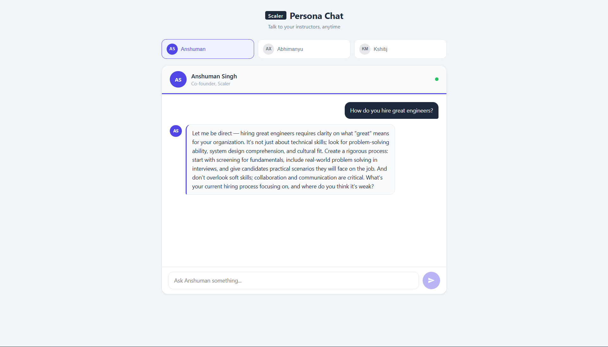
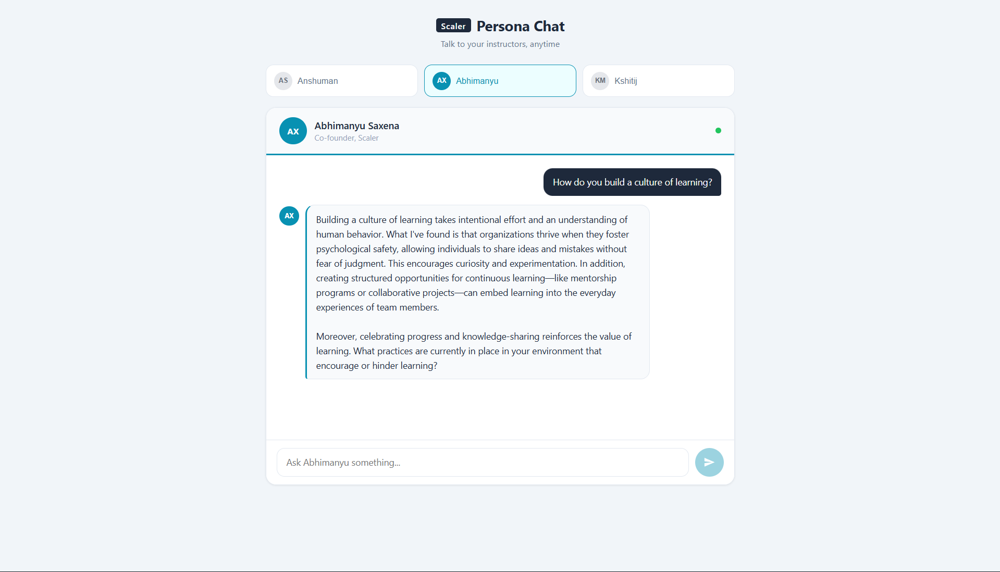
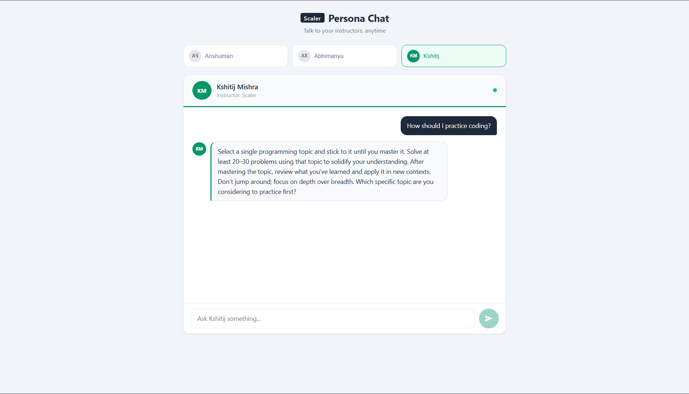

# Persona-Based AI Chatbot

A React + Node.js application that simulates conversations with different tech leaders using **prompt-engineered personas**.

Each persona is designed using structured prompt engineering techniques such as:

* Persona definition
* Few-shot learning
* Chain-of-thought reasoning
* Output formatting
* Constraints

---

##  Live Demo

Frontend: https://persona-based-ai-chatbot.vercel.app  
Backend: https://persona-based-ai-chatbot-thuu.onrender.com

---

##  Personas

### 1. Anshuman Singh

* Direct, analytical, first-principles thinker
* Challenges assumptions and focuses on fundamentals

### 2. Abhimanyu Saxena

* Reflective, calm, human-centered thinker
* Focuses on systems, habits, and long-term growth

### 3. Kshitij Mishra

* Execution-focused, precise instructor
* Emphasizes clarity, correctness, and mastery

---

##  Tech Stack

* **Frontend:** React (Create React App)
* **Backend:** Node.js, Express
* **API:** AICredits (GPT-4o-mini)
* **Deployment:**

  * Frontend → Vercel
  * Backend → Render

---

##  Setup Instructions

### 1. Clone the Repository

```bash
git clone https://github.com/your-username/persona-based-ai-chatbot.git
cd persona-based-ai-chatbot
```

---

### 2. Setup Backend

```bash
cd backend
npm install
```

Create a `.env` file inside `backend/`:

```env
AICREDITS_API_KEY=your_api_key_here
```

Run backend:

```bash
node server.js
```

---

### 3. Setup Frontend

```bash
npm install
npm start
```

---

### 4. Update API URL

In `App.jsx`, ensure:

```js
https://persona-based-ai-chatbot-thuu.onrender.com/chat
```

---

##  Project Structure

```text
persona-based-ai-chatbot/
│
├── backend/        # Express server (API proxy)
├── src/            # React frontend
├── public/
├── personas.js     # Core prompt engineering logic
├── prompts.md      # Annotated system prompts
├── reflection.md   # Project reflection
└── README.md
```

---

##  Features

* Multiple AI personas with distinct behavior
* Real-time chat interface
* Secure backend API handling
* Prompt-engineered responses
* Deployed full-stack application

---

##  Key Learnings

* Prompt engineering directly impacts AI behavior
* Few-shot examples significantly improve response quality
* Constraints prevent generic or incorrect outputs
* Different personas can be simulated using structured prompts

---

##  Documentation

* `prompts.md` → Annotated system prompts
* `reflection.md` → Learnings and improvements

---

##  Author

Aditya Vikram Singh

## ScreenShots



